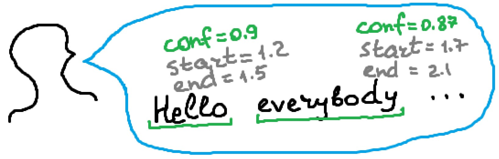

# Speech Recognition with Timestamps

Free and offline foreign (non-English) speech recognition with timestamps with Python and vosk.

## Setup

Read [these instructions](https://medium.com/@andimid/offline-foreign-speech-recognition-32d8d63de2dc) to know what how to set up vosk library. They are also available [here](https://gitlab.com/Winston-90/foreign_speech_recognition/-/blob/main/tutorial.md). in Short, you need:
- install vosk with `pip install vosk`
- download [vosk model](https://alphacephei.com/vosk/models), unzip it and specify path to the model in program

**Important** - audio must be in **wav mono** format. The program will check it, and if your audio file is encoded in a different format, convert it to wav mono with some free online tools like [this](https://audio.online-convert.com/convert-to-wav).

## Jupyter Notebook

See [jupyter notebook](https://gitlab.com/Winston-90/foreign_speech_recognition/-/blob/main/timestamps/word_timestamps.ipynb), which contains code with detailed comments.

Open it with [jupyter](https://jupyter.org/) or see directly in a browser.

